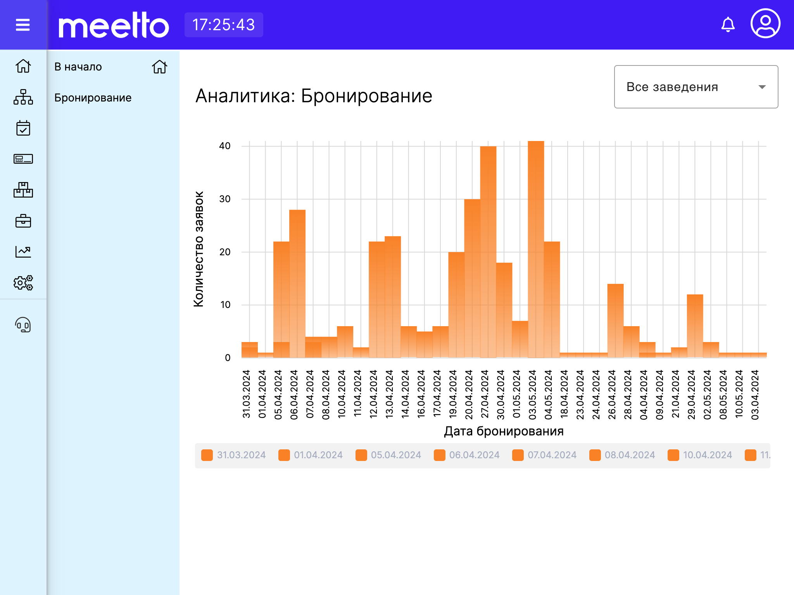

# Аналитика бронирования

Модуль аналитика представляет собой ряд разделов, отображающих исторические данные в зависимости от источника их появления. Например, раздел "Аналитика бронирования" представляет собой диаграму всех заявок на бронирование с фильтрацией по периоду дат, а также по конкретному заведению.

Для смены периода дат необходимо выбрать диапазон значений из календаря в верхней правой части экрана.

Для отображения аналитики по конкретному заведению, либо по всем заведениям сразу, необходимо выбрать вариант отображения из выпадающего списка в верхней правой части экрана.

Ниже представлен пример отображения раздела "Аналитика бронирования" в приложении Meetto.Manager:

<figure><figcaption></figcaption></figure>
