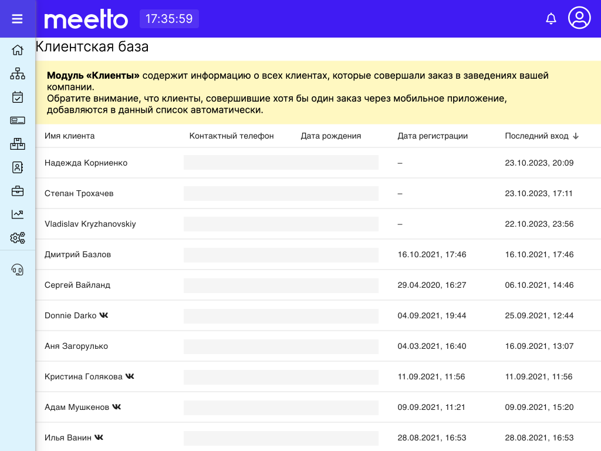

# Клиенты (клиентская база)

Раздел "Клиенты" модуля CRM представляет собой отображение списка всех клиентов, которые так или иначе контактировали с вашими заведениями посредством приложений системы Meetto.

В списке клиентов отображены фамилия, имя клиента, дата регистрации в Meetto.Client а также дата последнего входа в учетную запись в мобильных приложениях Meetto.Client.

В случае, если клиент проходил регистрацию или привязал аккаунт ВКонтакте к своей учетной записи Meetto.Client, то справа от фамиилии и имени клиента будет отображена иконка vk.

Ниже представлен примерный вид списка клиентов в Meetto.Manager:

<figure><figcaption></figcaption></figure>
