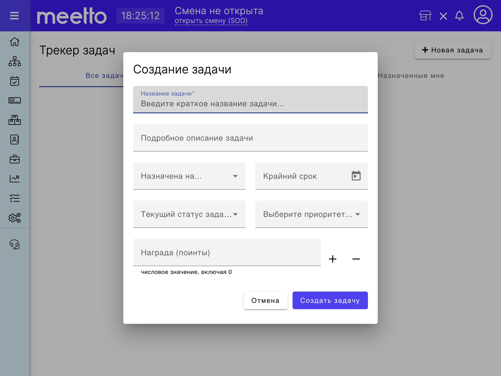

# Создание новой задачи в таск-трекере

Трекер задач (таск-трекер) в системе Meetto представляет собой модуль с возможностью создания и ведения внутренних задач для персонала ваших заведений, а также предлагает введение внутренних мотивационных поинтов (баллов) для работников-исполнителей задач.

Для создания новой задачи в таск-трекере необходимо заполнить все обязательные поля в диалоговом окне создания новой задачи:

* Название задачи
* Подробное описание задачи
* Назначена на... (выпадающий список с фамилиями и именами работников заведения)
* Крайний срок (дата не ранее текущей)
* Текущий статус задачи (выпадающий список статусов задачи)
* Выберите приоритет (выпадающий список вариантов приоритетов)
* Награда (поинты, тут может быть указано вознаграждение в баллах для исполнителя)

В Meetto.Manager диалоговое окно добавления новой задачи выглядит следующим образом:

<figure><figcaption></figcaption></figure>
